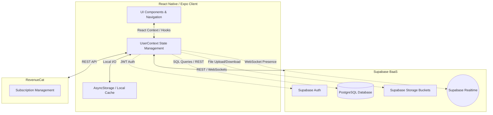
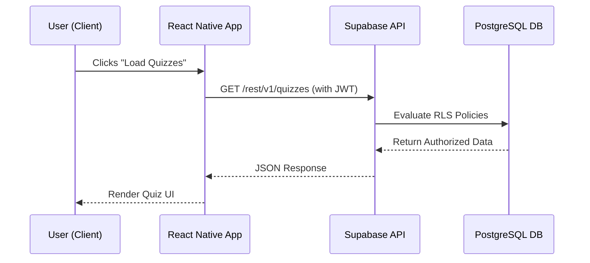
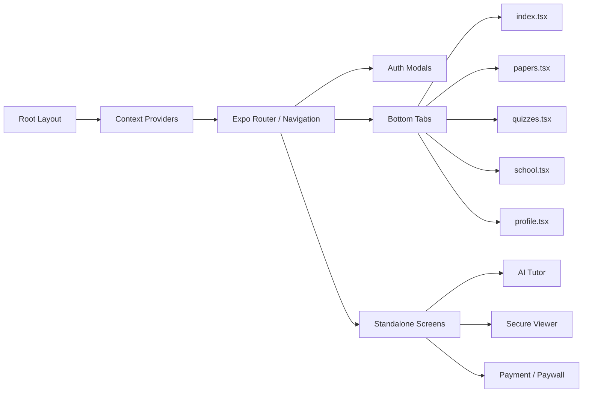

# System Architecture - NamStudy Prep (v1.0.0)

This document outlines the high-level architecture, communication channels, and data flow of the NamStudy Prep application.

## 1. High-Level Architecture Overview

NamStudy Prep follows a modern, serverless mobile architecture. The frontend is fully decoupled from the backend infrastructure, relying on Backend-as-a-Service (BaaS) providers for data persistence, authentication, and monetization.

## 2. Communication Channels & Data Flow

### 2.1 Authentication Flow
Authentication is managed entirely by Supabase.
1. The user inputs credentials via `AuthModal.tsx`.
2. The app sends a request to Supabase Auth over HTTPS.
3. Supabase returns a secure JSON Web Token (JWT).
4. The JWT is cached locally using `AsyncStorage` to maintain sessions across app restarts.
5. All subsequent database and storage requests automatically attach this JWT in the headers.

### 2.2 Database Operations (PostgreSQL)
All structured data (User Profiles, Quizzes, Papers Metadata, Timetables, Notices, AI Messages) resides in Supabase PostgreSQL.
- **Client-Side Fetching**: The app uses the `supabase-js` client to execute queries over HTTPS (PostgREST).
- **Row Level Security (RLS)**: Before executing any query, Supabase Postgres evaluates the attached JWT against RLS policies. For example, a student attempting to insert a timetable event will be rejected because the RLS policy requires `is_school_admin = true` or `is_admin = true`.

### 2.3 Storage and Secure Documents
Large files and media are stored in Supabase Storage Buckets (`avatars`, `school-logos`, `papers`, `solutions`).
- **Public Assets**: Avatars and Logos are served via standard HTTPS public URLs (`getPublicUrl`).
- **Secure Documents (Past Papers)**: To prevent unauthorized distribution, the app requests a **Signed URL** with a 60-second expiration (`createSignedUrl`). The `secure-viewer.tsx` module then loads this URL into a WebView while simultaneously locking down the OS screen-capture APIs.

### 2.4 Real-Time Analytics (WebSockets)
The app utilizes Supabase Realtime (built on Elixir/Phoenix WebSockets) to track live online user counts.
- Upon login, the client establishes a persistent WebSocket connection to the `namstudy-presence` channel.
- It broadcasts a presence "sync" event.
- All connected clients instantly receive the updated state, allowing the `AdminDashboard` and `analytics.tsx` to display real-time live users without polling the database.

### 2.5 In-App Purchases (RevenueCat)
Monetization is decoupled from the main database to handle Apple/Google store complexities.
- The app communicates with RevenueCat via the `react-native-purchases` SDK.
- When a user purchases a VIP subscription, RevenueCat verifies the receipt with Apple/Google.
- The client-side `CustomerInfo` object is updated, which the `UserContext` listens to. The app then grants access to premium content.

## 3. Module Hierarchy (Frontend)

## 4. Security Boundaries

- **Local State**: Non-sensitive data is cached via `AsyncStorage` (e.g., bookmarks, streak offline counts).
- **Network Level**: All communications to Supabase and RevenueCat are encrypted over TLS/HTTPS or Secure WebSockets (WSS).
- **Database Level**: RLS acts as the definitive gatekeeper. The frontend UI assumes roles (e.g., hiding Admin tabs), but the ultimate security check occurs at the Postgres level.
